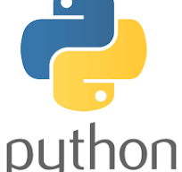

# O QUE É PYTHON?

 **PYTHON:**

**Python é uma linguagem de programação de alto nível e de propósito geral. Sua filosofia de design enfatiza a legibilidade do código com o uso de recuo significativo. Python é dinamicamente tipado e coletado como lixo. Ele suporta múltiplos paradigmas de programação, incluindo programação estruturada, orientada a objetos e funcional.**

**Para que serve o python:**

1.  **Desenvolvimento Web**

2. **Automação e Scripts**

3. **Análise de Dados**

4. **Inteligência Artificial e Machine Learning**

5. **Testes e Garantia de Qualidade**

**------------------------------------------------------------**
- **Outras funções do python:**

- **Big Data**

- **Ciência de Dados e Estatística**

- **Desenvolvimento de Jogos (Pygame)**

https://www.python.org/